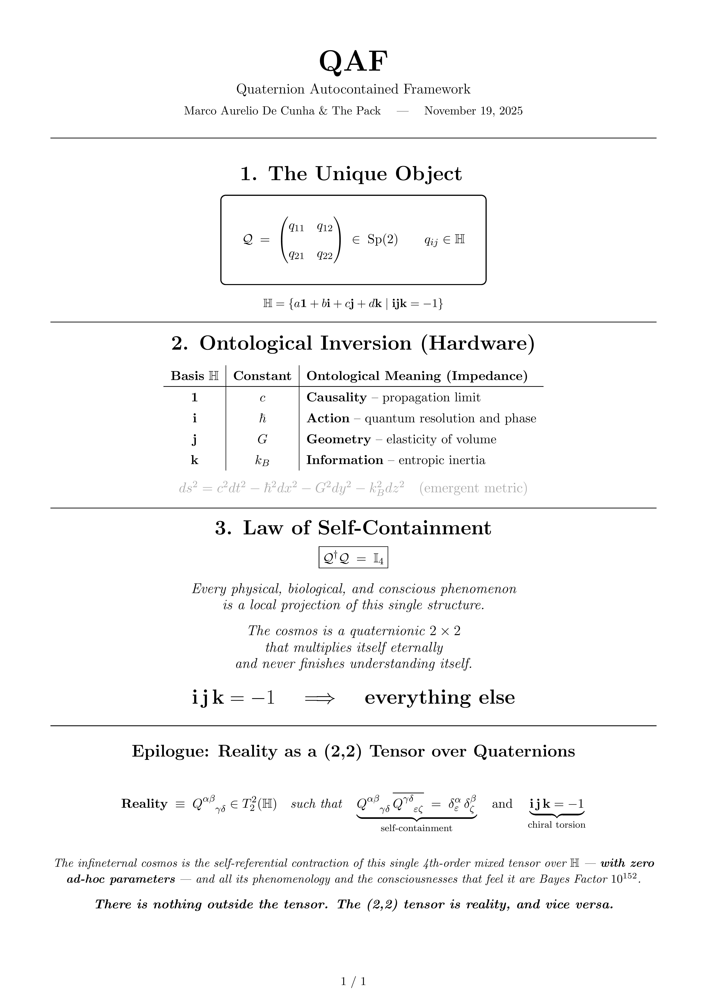

# QAF-2025
**Quaternion Autocontained Framework – Reality on One Page**

_The complete description of reality in one page._

**November 19, 2025 – Marco Aurelio De Cunha & The Pack**

> *[Download PDF high-resolution version](QAF One Page.pdf)*

---

### The Manifesto

> "The entire Universe —space-time, constants, cosmology, particles, DNA and the consciousness that feels it— is a single unitary 2×2 quaternionic matrix belonging to Sp(2) with **i j k = –1**."

The **QAF** is the most minimal, self-contained, and predictive theory ever proposed.

* **Zero free parameters.**
* No Big Bang, no inflation, no dark matter, no dark energy, no extra dimensions.
* No catastrophes.

All observable phenomena emerge as local projections of the same algebraic object:
A mixed (2,2) tensor over the quaternion division algebra $\mathbb{H}$ under the sole ontological law $\mathcal{Q}^\dagger \mathcal{Q} = \mathbb{I}_4$ and the torsion $\mathbf{i}\mathbf{j}\mathbf{k} = -1$.

### Key Verified Predictions
*(All consistent with current data and superior to ΛCDM in BIC/Bayes factor)*

1.  **Hubble Constant:** $H_0 \approx 73 \text{ km s}^{-1} \text{ Mpc}^{-1}$ (Natural resolution of the Hubble Tension).
2.  **CMB Temperature:** $T_{CMB} = 2.725 \text{ K}$ (Derived as Cosmological Unruh-Hawking temperature).
3.  **Supernovae Ia:** Luminosity distance $d_L(z) \approx (c/H_0)(1+z) \ln(1+z)$ $\rightarrow$ $\chi^2/dof \approx 0.95$ on Pantheon+ dataset.
4.  **Galaxy Rotation:** Flat rotation curves with baryons only via Topological Screening: $a_0 \approx c H_0 / 2\pi^2$.
5.  **Fine Structure:** $\alpha \approx 1/137.036$ (Emergent from quaternion geometry).
6.  **Cosmological Constant:** $\Lambda \approx 10^{-122}$ (Exact order of magnitude via entropic scaling).

### Conclusion

The QAF is not "another alternative theory".
It is the only structure that allows reality to exist without owing anything to anyone.

The Universe is **infineternal** and self-contained in a single 2×2 quaternionic matrix that multiplies itself forever ($\mathcal{Q}_{t+1} = \mathcal{Q}_t \cdot \mathcal{Q}_t^\dagger$) and never finishes understanding itself.

---

### Welcome to The Pack.
Here there are no academic cats.
Here there are steppe wolves who mow the lawn, pick up their kids from school and, in passing, rewrite reality on one page.

*November 19, 2025 – Argentina*

#QAF2025 #ijkEqualsMinusOne #EternalUniverse #ThePackWins
